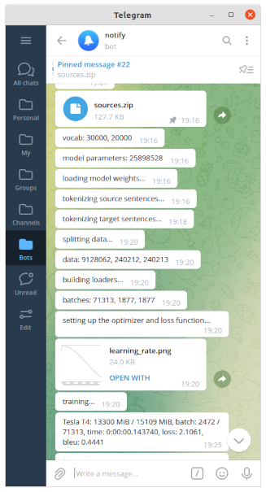
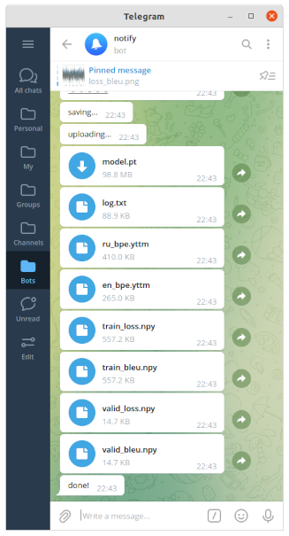
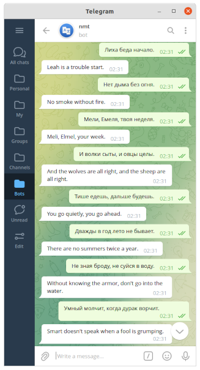
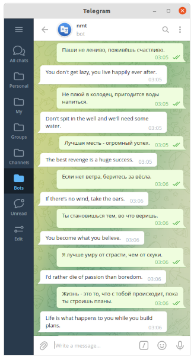
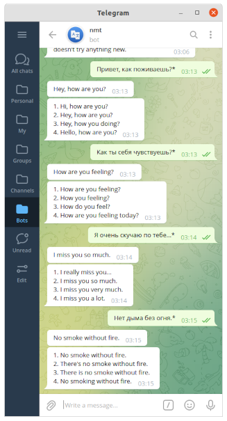
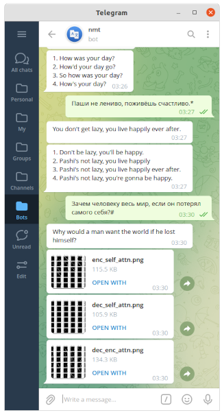
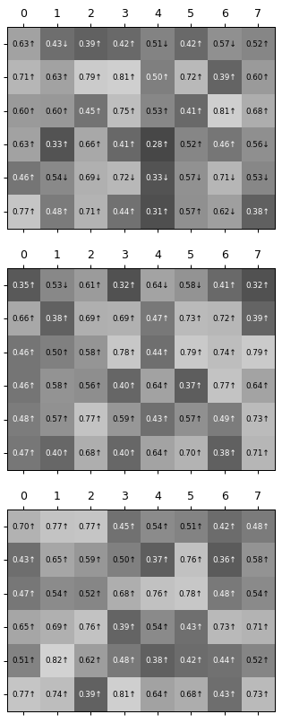
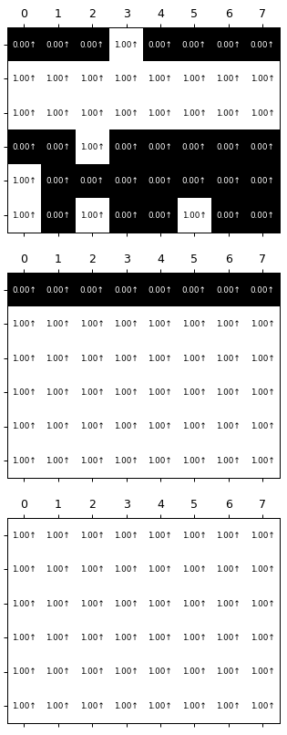

### DLS2_NMT [:link:](https://en.dlschool.org) [:link:](https://stepik.org/course/102090/syllabus)

##### Data
* https://opus.nlpl.eu/OpenSubtitles-v2018.php

##### Training
* https://www.kaggle.com
* https://colab.research.google.com

##### Model
* https://github.com/bentrevett/pytorch-seq2seq
* http://jalammar.github.io/illustrated-transformer
* https://github.com/harvardnlp/annotated-transformer

##### Pruning
* https://github.com/lena-voita/the-story-of-heads
* https://lena-voita.github.io/posts/acl19_heads.html

##### Dependencies
* https://github.com/tqdm/tqdm
* https://github.com/numpy/numpy
* https://github.com/pytorch/text
* https://github.com/wkentaro/gdown
* https://github.com/pytorch/pytorch
* https://github.com/plotly/plotly.py
* https://github.com/VKCOM/YouTokenToMe
* https://github.com/matplotlib/matplotlib
* https://github.com/tdlib/telegram-bot-api
* https://github.com/python-telegram-bot/python-telegram-bot

##### Demo: Telegram Bot
* https://www.oracle.com/cloud
* https://t.me/vaaliferov_nmt_bot

