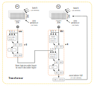
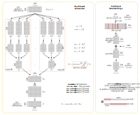
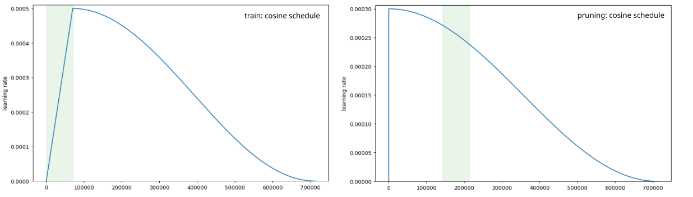

# Neural Machine Translation

* Transformer model for Neural Machine Translation from Russian to English
* PyTorch implementation of "Attention Is All You Need" by Ashish Vaswani et al. ([link](https://arxiv.org/abs/1706.03762))
* Implementation of the method for pruning of attention heads by Elena Voita et al. ([link](https://arxiv.org/abs/1905.09418))

## Data for training
* Dataset: OpenSubtitles v2018 ([link](https://opus.nlpl.eu/OpenSubtitles/ru&en/v2018/OpenSubtitles))
* Total number of sentence pairs in corpus: ~26M
* Number of sentence pairs in training: ~9M / ~250K / ~250K

## Architecture
* 6 layers, 8 heads, ~26M parameters
* max len = 100, hid dim = 256, pf dim = 512

## Tokenization
* Fast Byte Pair Encoding ([youtokentome](https://github.com/VKCOM/YouTokenToMe))
* Source / target vocabulary size: 30k / 20k tokens

## Training
* Dropout 0.1, gradient clipping 1
* Loss function: Cross Entropy Loss, Target Metric: BLEU
* 10 epochs, ~25 hours on Kaggle and Google Colab GPUs
* Loader: 128 sentence pairs / batch, 100 batches / chunk
* Optimizer: Adam, lr 0.0005, cosine schedule, warm up 70K steps

## Pruning
* λ = 0.05, β = 0.50, 70k iterations
* Gumbel noise, Hard Concrete Gates
* Extra penalty for too many attention heads

## Inference
* Greedy and Beam Search generation (k=4)

You can download and run it yourself or you can use this [bot](https://t.me/vaaliferov_nmt_bot).

```bash
python3 -m venv env
source env/bin/activate
pip install -r requirements.txt
gdown 1heNu80X8DcTKTx2Od0-EW-6JrkXxk5Ze
gdown 1c4LakbKi7-gbKyAvcoGkJ8Yic16wvJx0
gdown 1I46t9Qgz0NbXjT-EPbogEUYpvGPTc408
python3 bot.py <bot_owner_id> <bot_token>
```
<p align=center></p>
<p align=center></p>
<p align=center></p>
<p align=center></p>
<p align=center></p>
<p align=center></p>
<p align=center></p>
<p align=center></p>
<p align=center></p>
<p align=center></p>

<p align=center>
    
    
    
</p>
